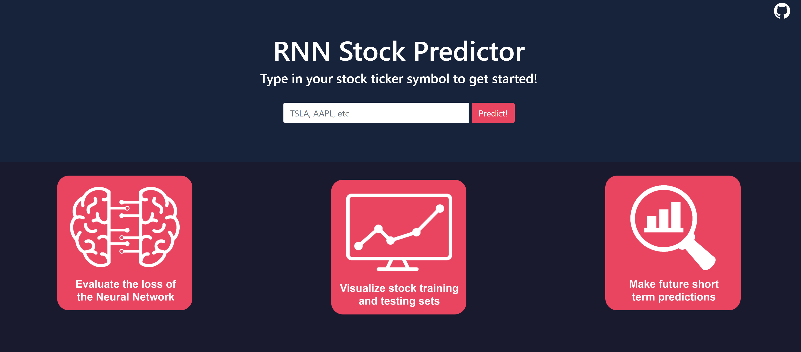
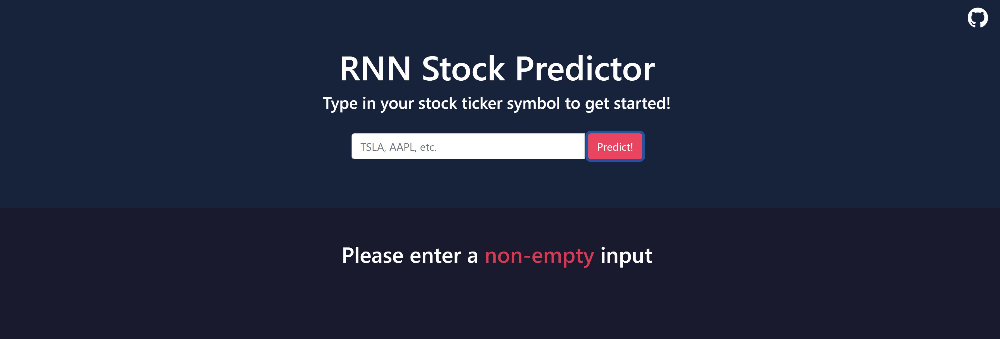
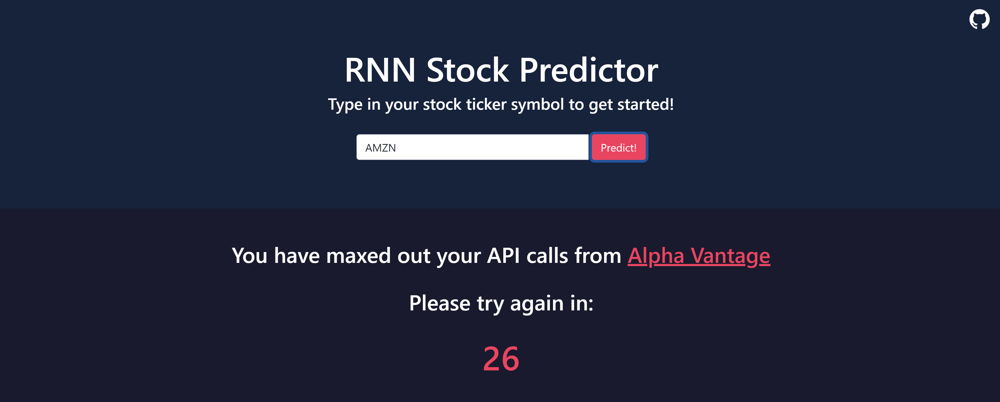
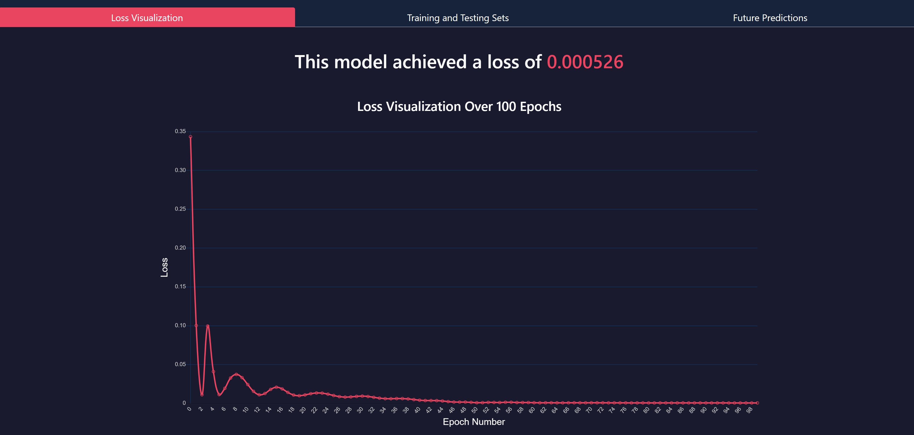
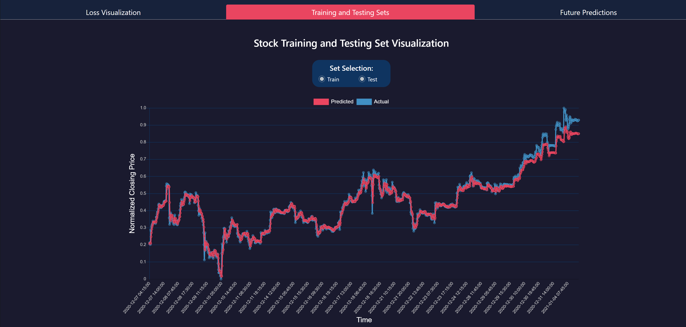
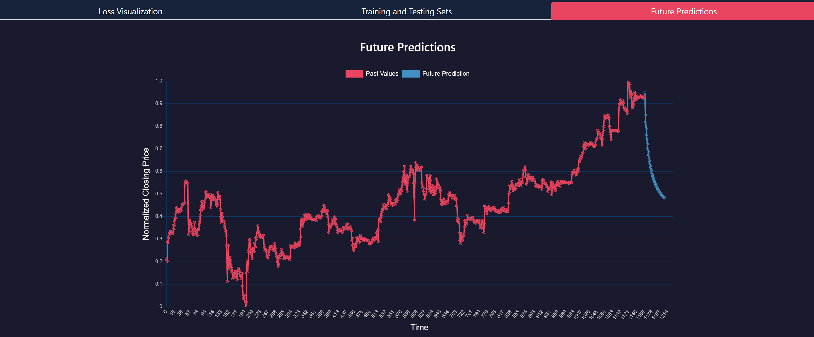

# Pytorch Stock RNN

This project's goal was to make predictions for stock closing prices using a Recurrent Neural Network and `Pytorch`. Afterwards, this project was deployed to Flask and linked with a React App

**Note: You can view the project [here](https://rnn-stock-predictor.herokuapp.com) on Heroku, but it still has some server-side issues**



### Table of Contents
- [Background Info](#bg) 
- [Getting Started](#start)  
- [Website Features](#features)
  - [Input Checking](#input)
  - [Invalid Stock](#invalid)
  - [API Overusage](#api)
  - [Loss Visualization](#loss)
  - [Training and Testing Sets](#sets)
  - [Future Predictions](#future)
- [Demo](#demo)
- [Future Work  / Conclusion](#conclusion)
- [Acknowledgements](#acknowledgement)
- [Author / Contact](#author)

<br />

<a name = "bg"/>

## Project Background Information

Predicting stocks is a very difficult task that experts have been trying to solve for a long time. Obviously there is no way to perfectly predict the stock market behvaior, as it is extremely volatile, but there are methods we can use to get close. In this project, we take a look at a `GRU`, a type of [Recurrent Neural Network](https://en.wikipedia.org/wiki/Recurrent_neural_network) to make our predictions:

The basic idea is that this network will first train a network taking in a fixed window size and then output a single prediction value. This value is then passed through a normal linear neural network to obtain a final projection. As time goes on, Recurrent Neural Networks are subject to the [Vanishing Gradient Problem](https://en.wikipedia.org/wiki/Vanishing_gradient_problem), meaning that the influence of past points are not as heavy as they should be. A `GRU`, or [Gated Recurrent Unit](https://en.wikipedia.org/wiki/Gated_recurrent_unit) is a type of Recurrent Neural Network that addresses this problem. The neural network structure can be found below:


*Note: The reason a `GRU` was chosen instead of an `LSTM` was for performance reasons during deployment to `Flask`* 

<br />

<a name = "start"/>

## Getting Started

To get this project running on your machine, follow the instructions below

### Jupyter Notebook

To make changes to the Jupyter Notebook, you will need to install [Pytorch](https://pytorch.org). You can find more in-depth instructions on how to do so [here](https://deeplizard.com/learn/video/UWlFM0R_x6I)

Alternatively, you can simply view the results of the Jupyter Notebook [here](https://jovian.ai/nishantbalepur/stock-predictions)

### Flask Web App

Before you are able to run the web server, you will need to install `Python` and `Flask`. Instructions on how to set up `Flask` with `Visual Studio Code` can be found [here](https://code.visualstudio.com/docs/python/tutorial-flask)

Now, run the following command to get the files on your machine

```
git clone https://github.com/nbalepur/Python-Stock-RNN.git
```

Navigate to `./Pytorch-Stock-RNN/`, and run the following command:

```
flask run
```

This will open up the website in locally in your default browser

<br />
<br />

<a name = "features"/>

## Website Features

The application's features can be broken down as follows:

- [Input Checking](#input)
- [Invalid Stock](#invalid)
- [API Overusage](#api)
- [Loss Visualization](#loss)
- [Training and Testing Sets](#sets)
- [Future Predictions](#future)

<br />

<a name = "input"/>

### Input Checking

If an invalid input is typed for the stock ticker symbol, the website will alert you with one of the following messages:

#### Empty Input Error



#### Non-Alphabetical Input Error


<br />

<a name = "invalid"/>

### Invalid Stock

If your stock symbol is mispelled or doesn't exist, the website will let you know:


<br />

<a name = "api"/>

### API Overusage

If the API from [Alpha Vantage](https://www.alphavantage.co) is overrused, you will be alerted, shown below:



Once the timer is up, you are free to make API calls once again

<br />

<a name = "loss"/>

### Loss Visualization

Once a valid input has been selected, you can view the loss development of the neural network under `Loss Visualization`. A sample loss visualization for `TSLA` can be seen below:



<br />

<a name = "sets"/>

### Training and Testing Sets

Under this tab, you can see the model's predictions on the training and testing sets. An example of this for `TSLA` can be seen below:



<br />

<a name = "future"/>

### Future Predictions

You can also see future short-term predictions for the chosen stock. Below is a visualization of the future predictions for `TSLA`:



<br />
<br />

<a name = "demo"/>

## Demo

[](https://drive.google.com/file/d/1xUtYf-f4QqhQENacb948LkGGM3uY3s3b/preview)

<br />
<br />

<a name = "conclusion"/>

## Future Work and Conclusion

In conclusion, I learned a lot from this project! This was my first real experience with `Pytorch`, and I was extremely happy with its ease of transition from `numpy`. I obtained more hands-on experience with Neural Networks and Machine Learning, and this was my first time ever working with a Recurrent Neural Network. I learned that the `LTSM` and `GRU` networks each have their own advantanges and disadvantages, and it was interesting to see the tradeoffs between the models

In the future, I hope I will be able to further expand upon this project to make the future predictions more accurate and robust. Right now, the `GRU` model predicts future stocks exponentially, and I want to do more research into the math behind the algorithm to see why that is. I believe that there are more complex variables I could add to this model, such as news sentiment or the state of the world's economy, that would help boost the predictions of this model

Additionally, I want to spend more time learning about deployment so I can successfully implement this application on the web

<br />
<br />

<a name = "acknowledgement"/>

## Acknowledgements

This project relied heavily on this paper by Rodolfo Saldanha, so thank you for putting out this information and making it accessible for beginners!

<br />
<br />

<a name = "author"/>

## Author Info / Contact

All of the code for this resository was written by me, Nishant Balepur. If you have any questions or concerns, feel free to reach out!

- [GitHub](https://www.github.com/nbalepur)
- [LinkedIn](https://www.linkedin.com/in/nishant-balepur-a03818107/)
- [Email](mailto:balepur2@illinois.edu)
